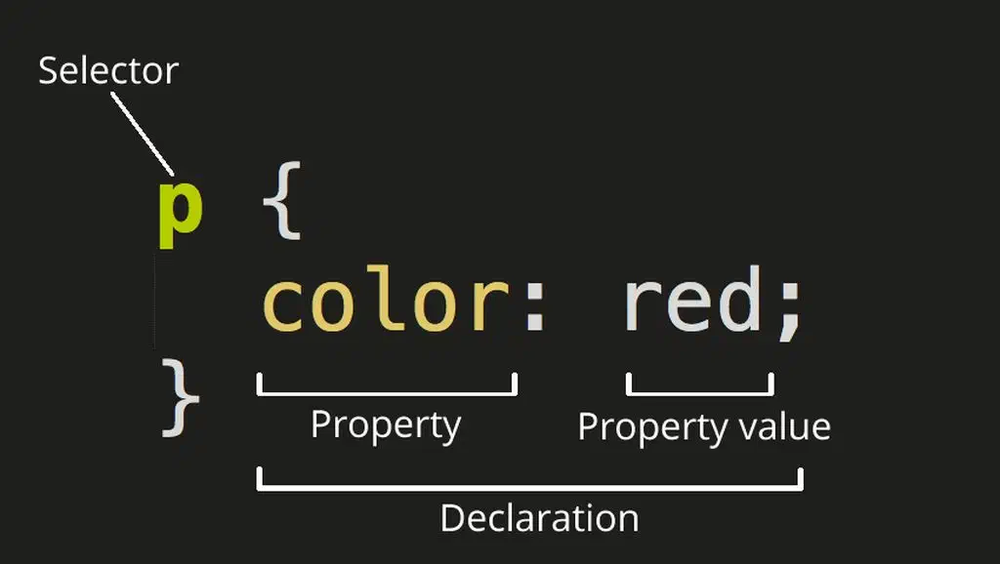

import BrowserWindow from '@site/src/components/BrowserWindow';
import Tabs from '@theme/Tabs';
import TabItem from '@theme/TabItem';

# CSS

<div style={{maxWidth: 350}}>


Новичок, когда изучает CSS 😊

</div>

## Что такое CSS

CSS — это код, который позволяет визуально оформить страницу: раскрасить подзаголовки, поменять фон или отформатировать изображение. CSS — важная часть фронтенд-разработки и один из ключевых навыков для веб-разработчика.

Ключ к пониманию того, как работает CSS, — само название кода. CSS или Cascading Style Sheets переводится как «каскадная таблица стилей». Расшифруем каждое слово, начиная с конца.

**Почему стили**

Стили — это визуальные особенности, которые нужно придать странице, например цвет текста, размер подзаголовка, тип шрифта или оформление иллюстрации.
Стили или свойства CSS называются правилами. Каждое правило состоит как минимум из одного селектора и одной пары «свойство — значение».

<div style={{maxWidth: 400}}>



</div>

Селектор нужен для того, чтобы браузер понимал, к какому элементу CSS будет применяться свойство: заголовку, абзацу, фоновому цвету.
Свойство показывает, что именно будет меняться в этом элементе: цвет, размер, выравнивание. Значение определяет, как именно изменится элемент: станет красным, увеличится вдвое, примет круглую форму.

Например, здесь:

```css
h2 {
  color: #32a846;
}
```
мы говорим браузеру: пусть все заголовки второго уровня (селектор `h2` ) будут иметь цвет (свойство `color` ) зелёный (значение #32a846).

Другие знаки — фигурные скобки, пробелы, абзацы и точки с запятой — не влияют на то, как браузер прочитает код. Они нужны для того, чтобы разработчику и его коллегам было проще читать и редактировать документ.

**Почему таблица**

Иногда CSS переводят как «каскадные списки стилей». Это тоже правильно: фактически тут нет привычных таблиц со строками и столбцами. Документ CSS — это перечень правил визуального оформления, в котором правила — стили — располагаются в виде списка в каскадном порядке.

**Почему каскад**

Каскад — один из самых важных принципов в оформлении CSS. Он означает, что все стили сортируются по определённым правилам. Принцип каскада влияет на то, как браузер прочтёт ваш код, и на то, что в итоге увидит пользователь на экране.

Например, сначала вы указали в коде, что все заголовки будут зелёными. А затем в середине документа — что они должны быть красными.

Правило порядка в коде гласит, что при равной специфичности правила, **написанные ниже по ходу «чтения», «перебивают» написанное выше**. Для браузера правило «покрасить заголовок в красный» важнее, чем правило «покрасить в зелёный», потому что оно написано ниже.

На правила каскада влияют и другие сущности. Например, специфичность правила, про которую мы упомянули выше. Специфичность может быть одинаковой у всех, а может «весить» по-разному: скажем, **правила, которые прописаны инлайном, «перебивают» правила на селектор**. Вот как это работает.

```html
<p>Цвет текста будет красным<p>
```

```css
p {
  color: red;
}
```

Если мы добавим в код инлайн-правило:

```html
<р style="color: blue">Цвет текста стал синим — инлайн «перебивает»</p>
```

то текст станет синим независимо от того, написан он вверху кода или внизу.


Дополнительную информацию о CSS можно почитать в этой статье:
- [Что такое CSS и почему без него не стать веб‑разработчиком](https://practicum.yandex.ru/blog/chto-takoe-css/)


## CSS селекторы
Ниже приведены часто используемые CSS селекторы, которые вам понадобятся для выполнения практического задания.

###  #idName
Использование символа решётки позволяет обратиться к уникальному идентификатору элемента `id`. Идентификатор `id` должен быть уникальным и может использоваться на странице только один раз. При возможности старайтесь обходиться без идентификаторов.

```css
#container {
 width: 960px;
 margin: auto;
}
```

###  .className
Селекторы класса определяют стиль элементов с определённым классом. Отличие селектора `class` от `id` в том, что класс не должен быть уникальным и может использоваться для выбора нескольких элементов на странице.

Например, этот селектор выберет абзац с классом `.highlight`

```html
<body>
  <p class="highlight">Текст</p>
  <p>Другой текст</p>
</body>
```

```css
.highlight {
  background-color: yellow;
}
```

###  tag
Селекторы типа выбирают элементы HTML-документа по их тегу. Например, селектор `p` выберет все `<p>` на странице:

```html
<body>
  <p>Текст</p>
  <p>Другой текст</p>
</body>
```

```css
p {
  font-size: 16px;
}
```

### Отношения
В CSS3 предусмотрено четыре вида отношений между элементами.

Самые известные вы наверняка знаете:
- `div p` – элементы p, являющиеся потомками div.
- `div > p` – только непосредственные потомки.

Есть и два более редких:
- `div ~ p` – правые соседи: все p на том же уровне вложенности, которые идут после div.
- `div + p` – первый правый сосед: p на том же уровне вложенности, который идёт сразу после div (если есть).

:::danger
Если ваш селектор выглядит так: `X Y Z A B.error`, то вы совершаете ошибку. Старайтесь избегать таких длинных вложений.
:::

### Селекторы псевдоклассов

#### `:hover`
Псевдокласс `:hover` соответствует элементу, когда пользователь наводит на него курсор мыши. Например, здесь псевдокласс используется, чтобы убрать подчёркивание ссылки:

```html
<a href="#">Нажми на меня</a>
```

```css
a:hover {
  text-decoration: none;
}
```

#### `:first-child`, `:last-child` и `:nth-child(n)`
Эти псевдоклассы выбирают элемент по его порядковому номеру. `:first-child` соответствует первому дочернему элементу родителя, `:last-child` — последнему. А псевдокласс `:nth-child(n)` указывает на n-й дочерний элемент. Например, с его помощью можно выбрать второй, пятый или предпоследний элемент. Вместо `n` в скобках указывается целое число или математическое выражение.

```html
<ul>
  <li>HTML</li>
  <li>CSS</li>
  <li>JavaScript</li>
</ul>
```

```css
/* выберет первый элемент — HTML*/
li:first-child {
  font-weight: 700;
}

/* выберет последний элемент — JavaScript*/
li:last-child {
  text-decoration: underline;
}

/* выберет второй элемент — CSS*/
li:nth-child(2) {
  font-weight: 700;
}
```

## Ссылки

- [30 CSS селекторов, которые вы должны запомнить](https://webdesign.tutsplus.com/ru/the-30-css-selectors-you-must-memorize--net-16048t)
- [Знаете ли вы селекторы?](https://learn.javascript.ru/css-selectors)
- [CSS-селекторы. шпаргалка для новичков](https://htmlacademy.ru/blog/css/selectors)
- [7 единиц измерения CSS, о которых вы могли не знать](https://webdesign.tutsplus.com/ru/7-css-units-you-might-not-know-about--cms-22573a)


