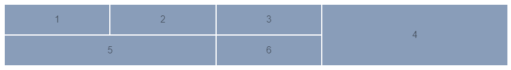

import BrowserWindow from '@site/src/components/BrowserWindow';
import Tabs from '@theme/Tabs';
import TabItem from '@theme/TabItem';

# Flexbox и CSS Grid

## Flexbox
Flexbox был представлен в 2009 году как новая технология для облегчения создания адаптивных веб-страниц и более удобной организации элементов на них, и с тех пор он получает все большее и большее распространение. В данный момент он используется как основной инструмент вёрстки для современных веб-страниц.

Чтобы начать использовать Flexbox, все, что вам нужно сделать, это создать «гибкий» контейнер с помощью свойства `display: flex;`. После этого каждый элемент, который у вас есть внутри этого гибкого контейнера, превращается в гибкий элемент.

Основное направление, которое наши Flex элементы принимают в контейнере - это строка.


Мы можем легко изменить направление наших Flex элементов в контейнере из строки на столбец, передав свойство: `flex-direction: column;`


### justify-content – выравнивание по главной оси
Css свойство `justify-content` определяет то, как будут выровнены элементы вдоль главной оси.

Доступные значения justify-content:
- `flex-start` (значение по умолчанию) : блоки прижаты к началу главной оси
- `flex-end` блоки прижаты к концу главной оси
- `center` блоки располагаются в центре главной оси
- `space-between` первый блок располагается в начале главной оси, последний блок – в конце, все остальные блоки равномерно распределены в оставшемся пространстве.
- `space-around`: все блоки равномерно распределены вдоль главной оси, разделяя все свободное пространство поровну.

### align-items – выравнивание по поперечной оси
Css свойство `align-items` определяет то, как будут выровнены элементы вдоль поперечной оси.

Доступные значения align-items:
- `flex-start` блоки прижаты к началу поперечной оси
- `flex-end` блоки прижаты к концу поперечной оси
- `center` блоки располагаются в центре поперечной оси
- `baseline` блоки выровнены по их baseline
- `stretch` (значение по умолчанию) : блоки растянуты, занимая все доступное место по поперечной оси, при этом все же учитываются min-width/max-width, если таковые заданы.

Чтобы лучше понять как работают свойства Flexbox, пройдите по ссылке ниже и посмотрите интерактивные примеры:
- [Шпаргалка по Flexbox CSS](https://tpverstak.ru/flex-cheatsheet/)


### Ссылки
- [Как работает CSS Flexbox](https://tproger.ru/translations/how-css-flexbox-works/)
- [Полное руководство по Flexbox выравниванию](https://webdesign.tutsplus.com/ru/a-comprehensive-guide-to-flexbox-alignment--cms-30183t)
- [Полное руководство по назначению  и изменению order во Flexbox](https://webdesign.tutsplus.com/ru/a-comprehensive-guide-to-flexbox-ordering-reordering--cms-31564t)
- [Как создать отзывчивую полноэкранную страницу с помощью Flexbox](https://webdesign.tutsplus.com/ru/how-to-build-a-full-screen-responsive-page-with-flexbox--cms-32086t)
- [FLEXBOX FROGGY GAME](https://flexboxfroggy.com/#ru)

## CSS Grid

CSS Grid - самая мощная система компоновки из доступных на данный момент в CSS. Это двумерная система, которая может обрабатывать как столбцы так и строки, в отличии от Flexbox, который в значительной степени является одномерной системой. При работе с CSS Grid, вы применяете CSS правила к родительским элементам (которые становятся Grid контейнерами) и к дочерним элементам (которые становятся Grid элементами).

Элемент к которому применяется `display: grid;` - это прямой родитель для всех элементов сетки. В этом примере `container` является контейнером. Дочерние элементы `item` (прямы потомки) контейнера являются элементами сетки.

```html
<div class="container">
  <div class="item"></div>
  <div class="item"></div>
  <div class="item"></div>
</div>
```

```css
.container {
  display: grid;
}
```

### Как устроен grid контейнер

<div style={{maxWidth: 700}}>


</div>

**Линия сетки (Grid Line)**

Разделительные линии, составляющие структуру для сетки. Они могут быть вертикальными (линии колонок) или горизонтальными (линии строк) и располагаться по обе стороны от строки или столбца.

**Трек сетки (Grid Track)**

Пространство между двумя соседними линиями. Трек можно представить как строку (колонка) или столбец (ряд).

**Ячейка сетки (Grid Cell)**

Пространство между линиями двух соседних строк и двух соседних столбцов. Это отдельная единица измерения сетки.

**Область сетки (Grid Area)**
Общее пространство окружённое четырьмя линиями. Область может состоять из любого количества ячеек.

Чтобы лучше понять как работают свойства CSS Grid, пройдите по ссылке ниже и посмотрите интерактивные примеры:
- [Шпаргалка по Flexbox CSS](https://tpverstak.ru/flex-cheatsheet/)

### Сравнение с Flexbox
В отличие от Flex, которая ориентирована на одну ось, Grid оптимизирована для двумерных компоновок: когда требуется расположить (выровнять) содержимое в обоих измерениях (по вертикали и горизонтали).

Кроме того, благодаря возможности явного позиционирования элементов в сетке, Grid позволяет выполнять кардинальные преобразования в структуре, не требуя никаких изменений HTML разметки. Комбинируя медиа-запросы со свойствами CSS, управляющими компоновкой контейнера grid и его дочерних элементов, можно адаптировать верстку под любые форм-факторы устройств.

Grid и Flexbox, имеют свои особенности и нельзя сказать, что одно заменяет другое. Скорее Флекс является дополнением к Грид, или наоборот.

Flexbox фокусируется на распределении пространства внутри одной оси, использует более простой подход к компоновке, может использовать систему упаковки строк на основе размера содержимого для управления своей вторичной осью и полагается на иерархию разметки. Тогда как Grid больше подходит для создания каркасов, потому что имеет более мощный и комплексный подход и в целом не зависит от иерархии разметки. В отдельных случаях Grid позволяет создать адаптивный макет, который невозможно создать с помощью Flex или как-то еще.

<div style={{maxWidth: 700}}>


*Flexbox - ориентируется по одной оси*

</div>

<div style={{maxWidth: 700}}>


*CSS Grid - ориентируется по двум осям*

</div>

Когда лучше использовать Flexbox, а когда использовать CSS Grid, можете прочитать в этих статьях:
- [Когда использовать Flexbox, а когда использовать CSS Grid](https://odva.pro/blog/flex_or_grid/)
- [When to use Flexbox and when to use CSS Grid](https://blog.logrocket.com/css-flexbox-vs-css-grid/)


### Ссылки
- [Шпаргалка по Grid CSS](https://tpverstak.ru/grid/)
- [Справочник по Grid CSS](https://morphismail.github.io/css-grid-manual/)
- [Grid by Example](https://gridbyexample.com/examples/)
- [GRID GARDEN GAME](https://cssgridgarden.com/#ru)

