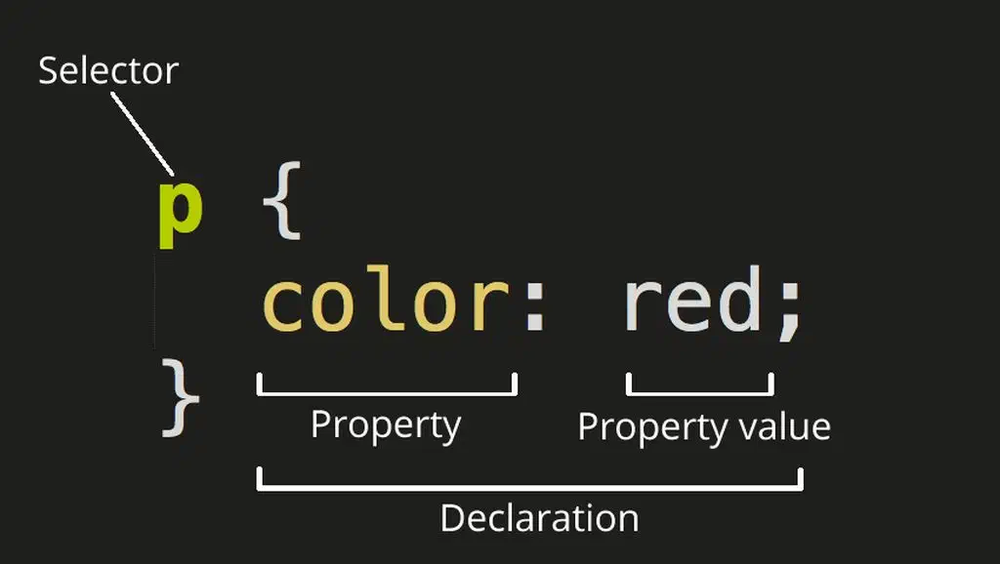
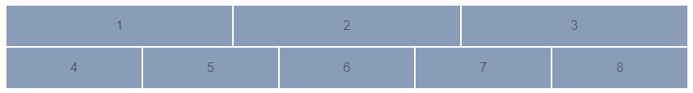
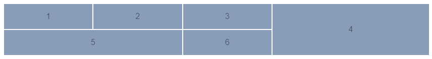

import BrowserWindow from '@site/src/components/BrowserWindow';
import Tabs from '@theme/Tabs';
import TabItem from '@theme/TabItem';

# CSS

<div style={{maxWidth: 350}}>


Начинающий, когда изучает CSS 😊

</div>

## Что такое CSS

CSS — это код, который позволяет визуально оформить страницу: раскрасить подзаголовки, поменять фон или отформатировать изображение. CSS — важная часть фронтенд-разработки и один из ключевых навыков для веб-разработчика.

Ключ к пониманию того, как работает CSS, — само название кода. CSS или Cascading Style Sheets переводится как «каскадная таблица стилей». Расшифруем каждое слово, начиная с конца.

**Почему стили**

Стили — это визуальные особенности, которые нужно придать странице, например цвет текста, размер подзаголовка, тип шрифта или оформление иллюстрации.
Стили или свойства CSS называются правилами. Каждое правило состоит как минимум из одного селектора и одной пары «свойство — значение».

<div style={{maxWidth: 400}}>



</div>

Селектор нужен для того, чтобы браузер понимал, к какому элементу CSS будет применяться свойство: заголовку, абзацу, фоновому цвету.
Свойство показывает, что именно будет меняться в этом элементе: цвет, размер, выравнивание. Значение определяет, как именно изменится элемент: станет красным, увеличится вдвое, примет круглую форму.

Например, здесь:

```css
h2 {
  color: #32a846;
}
```
мы говорим браузеру: пусть все заголовки второго уровня (селектор `h2` ) будут иметь цвет (свойство `color` ) зелёный (значение #32a846).

Другие знаки — фигурные скобки, пробелы, абзацы и точки с запятой — не влияют на то, как браузер прочитает код. Они нужны для того, чтобы разработчику и его коллегам было проще читать и редактировать документ.

**Почему таблица**

Иногда CSS переводят как «каскадные списки стилей». Это тоже правильно: фактически тут нет привычных таблиц со строками и столбцами. Документ CSS — это перечень правил визуального оформления, в котором правила — стили — располагаются в виде списка в каскадном порядке.

**Почему каскад**

Каскад — один из самых важных принципов в оформлении CSS. Он означает, что все стили сортируются по определённым правилам. Принцип каскада влияет на то, как браузер прочтёт ваш код, и на то, что в итоге увидит пользователь на экране.

Например, сначала вы указали в коде, что все заголовки будут зелёными. А затем в середине документа — что они должны быть красными.

Правило порядка в коде гласит, что при равной специфичности правила, **написанные ниже по ходу «чтения», «перебивают» написанное выше**. Для браузера правило «покрасить заголовок в красный» важнее, чем правило «покрасить в зелёный», потому что оно написано ниже.

На правила каскада влияют и другие сущности. Например, специфичность правила, про которую мы упомянули выше. Специфичность может быть одинаковой у всех, а может «весить» по-разному: скажем, **правила, которые прописаны инлайном, «перебивают» правила на селектор**. Вот как это работает.

```html
<p>Цвет текста будет красным<p>
```

```css
p {
  color: red;
}
```

Если мы добавим в код инлайн-правило:

```html
<р style="color: blue">Цвет текста стал синим — инлайн «перебивает»</p>
```

то текст станет синим независимо от того, написан он вверху кода или внизу.


Дополнительную информацию о CSS можно почитать в этой статье:
- [Что такое CSS и почему без него не стать веб‑разработчиком](https://practicum.yandex.ru/blog/chto-takoe-css/)


## CSS селекторы
Ниже приведены часто используемые CSS селекторы, которые вам понадобятся для выполнения практического задания.

###  #idName
Использование символа решётки позволяет обратиться к уникальному идентификатору элемента `id`. Идентификатор `id` должен быть уникальным и может использоваться на странице только один раз. При возможности старайтесь обходиться без идентификаторов.

```css
#container {
 width: 960px;
 margin: auto;
}
```

###  .className
Селекторы класса определяют стиль элементов с определённым классом. Отличие селектора `class` от `id` в том, что класс не должен быть уникальным и может использоваться для выбора нескольких элементов на странице.

Например, этот селектор выберет абзац с классом `.highlight`

```html
<body>
  <p class="highlight">Текст</p>
  <p>Другой текст</p>
</body>
```

```css
.highlight {
  background-color: yellow;
}
```

###  tag
Селекторы типа выбирают элементы HTML-документа по их тегу. Например, селектор `p` выберет все `<p>` на странице:

```html
<body>
  <p>Текст</p>
  <p>Другой текст</p>
</body>
```

```css
p {
  font-size: 16px;
}
```

### Отношения
В CSS3 предусмотрено четыре вида отношений между элементами.

Самые известные вы наверняка знаете:
- `div p` – элементы p, являющиеся потомками div.
- `div > p` – только непосредственные потомки.

Есть и два более редких:
- `div ~ p` – правые соседи: все p на том же уровне вложенности, которые идут после div.
- `div + p` – первый правый сосед: p на том же уровне вложенности, который идёт сразу после div (если есть).

:::danger
Если ваш селектор выглядит так: `X Y Z A B.error`, то вы совершаете ошибку. Старайтесь избегать таких длинных вложений.
:::

### Селекторы псевдоклассов

#### `:hover`
Псевдокласс `:hover` соответствует элементу, когда пользователь наводит на него курсор мыши. Например, здесь псевдокласс используется, чтобы убрать подчёркивание ссылки:

```html
<a href="#">Нажми на меня</a>
```

```css
a:hover {
  text-decoration: none;
}
```

#### `:first-child`, `:last-child` и `:nth-child(n)`
Эти псевдоклассы выбирают элемент по его порядковому номеру. `:first-child` соответствует первому дочернему элементу родителя, `:last-child` — последнему. А псевдокласс `:nth-child(n)` указывает на n-й дочерний элемент. Например, с его помощью можно выбрать второй, пятый или предпоследний элемент. Вместо `n` в скобках указывается целое число или математическое выражение.

```html
<ul>
  <li>HTML</li>
  <li>CSS</li>
  <li>JavaScript</li>
</ul>
```

```css
/* выберет первый элемент — HTML*/
li:first-child {
  font-weight: 700;
}

/* выберет последний элемент — JavaScript*/
li:last-child {
  text-decoration: underline;
}

/* выберет второй элемент — CSS*/
li:nth-child(2) {
  font-weight: 700;
}
```

### Ссылки

- [30 CSS селекторов, которые вы должны запомнить](https://webdesign.tutsplus.com/ru/the-30-css-selectors-you-must-memorize--net-16048t)
- [Знаете ли вы селекторы?](https://learn.javascript.ru/css-selectors)
- [CSS-селекторы. шпаргалка для новичков](https://htmlacademy.ru/blog/css/selectors)
- [7 единиц измерения CSS, о которых вы могли не знать](https://webdesign.tutsplus.com/ru/7-css-units-you-might-not-know-about--cms-22573a)


## Flexbox

- [Как работает CSS Flexbox](https://tproger.ru/translations/how-css-flexbox-works/)
- [Шпаргалка по Flexbox CSS](https://tpverstak.ru/flex-cheatsheet/)
- [FLEXBOX FROGGY GAME](https://flexboxfroggy.com/#ru)

### Ссылки
1. [Полное руководство по Flexbox выравниванию](https://webdesign.tutsplus.com/ru/a-comprehensive-guide-to-flexbox-alignment--cms-30183t)
2. [Полное руководство по назначению  и изменению order во Flexbox](https://webdesign.tutsplus.com/ru/a-comprehensive-guide-to-flexbox-ordering-reordering--cms-31564t)
3. [Как создать отзывчивую полноэкранную страницу с помощью Flexbox](https://webdesign.tutsplus.com/ru/how-to-build-a-full-screen-responsive-page-with-flexbox--cms-32086t)

## CSS Grid

CSS Grid - самая мощная система компоновки из доступных на данный момент в CSS. Это двумерная система, которая может обрабатывать как столбцы так и строки, в отличии от Flexbox, который в значительной степени является одномерной системой. При работе с CSS Grid, вы применяете CSS правила к родительским элементам (которые становятся Grid контейнерами) и к дочерним элементам (которые становятся Grid элементами).

Элемент к которому применяется `display: grid;` - это прямой родитель для всех элементов сетки. В этом примере `container` является контейнером. Дочерние элементы `item` (прямы потомки) контейнера являются элементами сетки.

```html
<div class="container">
  <div class="item"></div>
  <div class="item"></div>
  <div class="item"></div>
</div>
```

```css
.container {
  display: grid;
}
```

### Как устроен grid контейнер

<div style={{maxWidth: 700}}>


</div>

**Линия сетки (Grid Line)**

Разделительные линии, составляющие структуру для сетки. Они могут быть вертикальными (линии колонок) или горизонтальными (линии строк) и располагаться по обе стороны от строки или столбца.

**Трек сетки (Grid Track)**

Пространство между двумя соседними линиями. Трек можно представить как строку (колонка) или столбец (ряд).

**Ячейка сетки (Grid Cell)**

Пространство между линиями двух соседних строк и двух соседних столбцов. Это отдельная единица измерения сетки.

**Область сетки (Grid Area)**
Общее пространство окружённое четырьмя линиями. Область может состоять из любого количества ячеек.

### Сравнение с Flexbox
В отличие от Flex, которая ориентирована на одну ось, Grid оптимизирована для двумерных компоновок: когда требуется расположить (выровнять) содержимое в обоих измерениях (по вертикали и горизонтали).

Кроме того, благодаря возможности явного позиционирования элементов в сетке, Grid позволяет выполнять кардинальные преобразования в структуре, не требуя никаких изменений HTML разметки. Комбинируя медиа-запросы со свойствами CSS, управляющими компоновкой контейнера grid и его дочерних элементов, можно адаптировать верстку под любые форм-факторы устройств.

Grid и Flexbox, имеют свои особенности и нельзя сказать, что одно заменяет другое. Скорее Флекс является дополнением к Грид, или наоборот.

Flexbox фокусируется на распределении пространства внутри одной оси, использует более простой подход к компоновке, может использовать систему упаковки строк на основе размера содержимого для управления своей вторичной осью и полагается на иерархию разметки. Тогда как Grid больше подходит для создания каркасов, потому что имеет более мощный и комплексный подход и в целом не зависит от иерархии разметки. В отдельных случаях Grid позволяет создать адаптивный макет, который невозможно создать с помощью Flex или как-то еще.


<div style={{maxWidth: 700}}>


*Flexbox - ориентируется по одной оси*

</div>

<div style={{maxWidth: 700}}>


*CSS Grid - ориентируется по двум осям*

</div>

- [Когда использовать Flexbox, а когда использовать CSS Grid](https://odva.pro/blog/flex_or_grid/)
- [When to use Flexbox and when to use CSS Grid](https://blog.logrocket.com/css-flexbox-vs-css-grid/)


### Ссылки
- [Шпаргалка по Grid CSS](https://tpverstak.ru/grid/)
- [Справочник по Grid CSS](https://morphismail.github.io/css-grid-manual/)
- [Grid by Example](https://gridbyexample.com/examples/)
- [GRID GARDEN GAME](https://cssgridgarden.com/#ru)


## Часто используемые кейсы:

### Position relative/absolut

### Адаптивные изображения

Адаптивные изображения будут автоматически корректироваться в соответствии с размером экрана.

Важно знать, что вы всегда **должны использовать относительные единицы** для свойства ширины, такие как процент, а не абсолютные единицы, такие как пиксели.

```html

```

Если требуется масштабировать изображение как вверх, так и вниз при отклике, задайте для свойства CSS значение `width: 100%` и значение `height: auto`:

```css
.responsive {
  width: 100%;
  height: auto;
}
```

Если требуется, чтобы изображение было масштабировано, но никогда не масштабируется до размера, превышающего его исходный размер, используйте `max-width: 100%`:

```css
.responsive {
  max-width: 100%;
  height: auto;
}
```

Если требуется ограничить адаптивный образ максимальным размером, используйте свойство с выбранным `max-width` пиксельным значением:

```css
.responsive {
  width: 100%;
  max-width: 400px;
  height: auto;
}
```

Чтобы иметь больший контроль над вашими изображениями, CSS предоставляет другое свойство, называемое `object-fit`. При необходимости вы также можете использовать свойство `object-position` (в дополнение к `object-fit`), чтобы сфокусироваться на определенной части изображения.

```css
.responsive {
  width: 100%;
  height: 300px; 
  object-fit: cover;
  object-position: bottom;
}
```

### Контейнер с отступами по краям

Веб-сайт должен иметь ограничивающую оболочку (контейнер), облегчающую чтение. Без использования элемента-обёртки дочерние элементы будут размещаться, ориентируясь на края экрана. Это может быть неудобным для пользователей. Особенно для тех, которые работают на больших экранах.

Для создания контейнера необходимо все дочерние элементы обернуть одним родительским тэгом `div` с классом `.container` или `.wrapper` и задать ему ширину.

Свойство `width` для настройки ширины контейнеров использовать не рекомендуется. Дело в том, что это приводит к необходимости горизонтального скроллинга страницы в том случае, если ширина области окна браузера, доступной для вывода страницы, меньше указанной ширины. Решить эту проблему можно, воспользовавшись свойством `max-width`.

Для того чтобы выровнять контейнер по центру страницы, нужно, при настройке его внешних отступов, воспользоваться значением `auto` для левого и правого отступов `margin: 0 auto;`

<Tabs>
<TabItem value="html" label="HTML">
<div style={{height: '140px', overflow: 'auto'}}>

```html
<div class="container">
  <main>...</main>
</div>
```

</div>
</TabItem>

<TabItem value="css" label="CSS">
<div style={{height: '140px', overflow: 'auto'}}>

```css
.container {
  max-width: 700px;
  margin: 0 auto;
}
```

</div>
</TabItem>

</Tabs>


### Адаптивная сетка

Это такая сетка, которая подстраивает количество столбцов в зависимости от разрешения экрана. То есть на экране смартфона сайт будет выглядеть иначе, чем на экране ноутбука или планшета, чтобы пользователю было комфортно взаимодействовать с интерфейсом. Такие сетки используются, например, для карточек товаров в интернет-магазинах. 

Пример адаптивной сетки на **Flexbox** и **CSS Grid**

<Tabs>
<TabItem value="html" label="HTML">
<div style={{height: '380px', overflow: 'auto'}}>

```html
<div class="container">
  <div class="grid">
    <div class="item-wrap">
      <div class="item"></div>
    </div>
    <div class="item-wrap">
      <div class="item"></div>
    </div>
    <div class="item-wrap">
      <div class="item"></div>
    </div>
    <div class="item-wrap">
      <div class="item"></div>
    </div>
    <div class="item-wrap">
      <div class="item"></div>
    </div>
    <div class="item-wrap">
      <div class="item"></div>
    </div>
    <div class="item-wrap">
      <div class="item"></div>
    </div>
    <div class="item-wrap">
      <div class="item"></div>
    </div>
  </div>
</div>
```

</div>
</TabItem>

<TabItem value="flexbox" label="CSS Flexbox">
<div style={{height: '380px', overflow: 'auto'}}>

```css
.container {
  max-width: 700px;
  margin: 0 auto;
}

.grid {
  display: flex;
  flex-wrap: wrap;
  flex-direction: row;
}

.item-wrap {
  box-sizing: border-box;
  padding: 10px;
  height: 150px;
  flex-basis: 25%;
}

.item {
  background: #aaa;
  height: 100%;
  width: 100%;
}

@media (max-width: 600px) {
  .item-wrap {
    flex-basis: 33.33%;
  }
}

@media (max-width: 500px) {
  .item-wrap {
    flex-basis: 50%;
  }
}

@media (max-width: 400px) {
  .item-wrap {
    flex-basis: 100%;
  }
}
```

</div>
</TabItem>

<TabItem value="grid" label="CSS Grid">
<div style={{height: '380px', overflow: 'auto'}}>

```css
.container {
  max-width: 700px;
  margin: 0 auto;
}

.grid {
  display: grid;
  grid-template-columns: repeat(4, 1fr);
  gap: 20px;
}

.item-wrap {
  box-sizing: border-box;
  height: 150px;
  background: #aaa;
}

@media (max-width: 600px) {
  .grid {
    grid-template-columns: repeat(3, 1fr);
  }
}

@media (max-width: 500px) {
  .grid {
    grid-template-columns: repeat(2, 1fr);
  }
}

@media (max-width: 400px) {
  .grid {
    grid-template-columns: repeat(1, 1fr);
  }
}
```

</div>
</TabItem>

<TabItem value="res" label="Результат">
<BrowserWindow style={{height: '380px', overflow: 'auto'}}>
  <div className="css-container">
    <div className="css-flex-grid">
      <div className="css-item-wrap">
        <div className="css-item"></div>
      </div>
      <div className="css-item-wrap">
        <div className="css-item"></div>
      </div>
      <div className="css-item-wrap">
        <div className="css-item"></div>
      </div>
      <div className="css-item-wrap">
        <div className="css-item"></div>
      </div>
      <div className="css-item-wrap">
        <div className="css-item"></div>
      </div>
      <div className="css-item-wrap">
        <div className="css-item"></div>
      </div>
      <div className="css-item-wrap">
        <div className="css-item"></div>
      </div>
      <div className="css-item-wrap">
        <div className="css-item"></div>
      </div>
    </div>
  </div>
</BrowserWindow>
</TabItem>

</Tabs>


### Footer внизу страницы

Как прижать footer сайта в самый низ окна браузера, чтобы страница при этом выглядела вытянутой на всю высоту, вне зависимости от объема контента? Сделать это можно с помощью Flexbox и CSS Grid.

<Tabs>
<TabItem value="html" label="HTML">
<div style={{height: '270px', overflow: 'auto'}}>

```html
<div class="container">
  <header class="header">header</header>
  <main class="main">main</main>
  <footer class="footer">footer</footer>
</div>
```

</div>
</TabItem>

<TabItem value="flexbox" label="CSS Flexbox">
<div style={{height: '270px', overflow: 'auto'}}>

```css
body {
  margin: 0;
}

.container {
  min-height: 100vh;
  display: flex;
  flex-direction: column;
  
}

.header {
  background: #abc;
  padding: 10px 0;
}

.footer {
  background: #aaa;
  padding: 10px 0;
  margin-top: auto;
}
```

</div>
</TabItem>

<TabItem value="grid" label="CSS Grid">
<div style={{height: '270px', overflow: 'auto'}}>

```css
body {
  margin: 0;
}

.container {
  min-height: 100vh;
  display: grid;
  grid-template-rows: auto 1fr auto;
}

.header {
  background: #abc;
  padding: 10px 0;
}

.footer {
  background: #aaa;
  padding: 10px 0;
  margin-top: auto;
}
```

</div>
</TabItem>

<TabItem value="res" label="Результат">
<BrowserWindow style={{height: '270px', overflow: 'auto'}}>
  <div className="fb-container">
    <header className="fb-header">header</header>
    <main className="fb-main">main</main>
    <footer className="fb-footer">footer</footer>
  </div>
</BrowserWindow>
</TabItem>

</Tabs>


